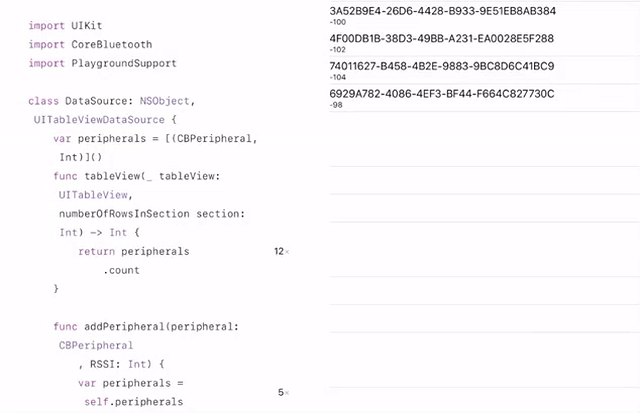

# Playground-Bluetooth-Book

Swift Playground Book that deals with Core Bluetooth

## How to send to iPad

- Download [Latest Archive] or clone Git repository
- Enable AirDrop on iPad
- Open _AirDrop_ window by hitting <kbd>&#x2318; + &#x21E7; + R</kbd>
- Drop `Bluetooth.playgroundbook` on your iPad

[Latest Archive]: https://github.com/ngs/Playground-Bluetooth-Book/archive/master.zip
